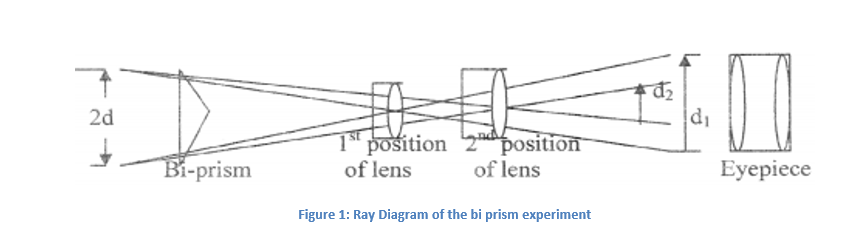
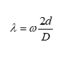

Fresnel’s bi Prism is a glass prism consisting of one angle approximately 1790 and other two angles approx 0.5 0.  Light coming from monochromatic light Source(Sodium Light approx wavelength 5896 A0) falls symmetrically on the biprism, the biprism divides the incident wave-front into two parts which on passing through the upper half and the lower half of the biprism appear to diverge from the virtual images S1 and S2. The distance between these virtual images is of ‘mm’ order. These two images serve as the two coherent sources.  Consequently, interference fringes are observed on the overlapping region of the two emergent beams of light. In the case of bi-prism experiment the mean wavelength of the light source is given by:  

 
  

Where,   &omega; = fringe width
              2d = distance between the two virtual sources
               D = distance between the slit and the eyepiece
Distanced between the virtual sources is given by 2d = √ (d1.d2)
Where,
              d1 = distance between the two image formed by the convex lens in the first position.
              d2 = distance between the two image formed by the convex lens in the second position
              
         
