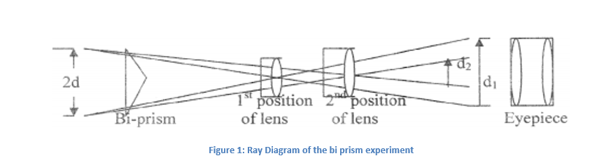

In the case of bi-prism experiment the mean wavelength 
  
&lambda;= &omega;. 2d/D   
Where,  &omega; = fringe width 
              2d = distance between the two virtual sources 
               D = distance between the slit and the eyepiece 
Distance between the virtual sources is given by 2d = √ (d1.d2) 
Where, 
              d1 = distance between the two image formed by the convex lens in the first position. 
              d2 = distance between the two image formed by the convex lens in the second position

              

