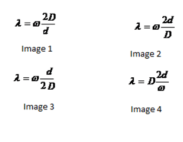
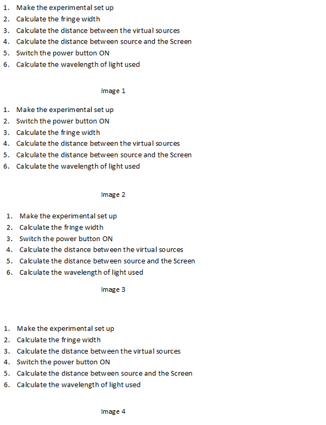

## Pedagogy (Round 1)

 
<b> Experiment : Measurement of the wavelength of monochromatic source of light with the help of Fresnel’s Bi prism     

<b>Discipline | <b>Physical Sciences
:--|:--|
<b> Lab | <b> Basics of Physics
<b> Experiment|     <b>  Measurement of the wavelength of monochromatic source of light with the help of Fresnel’s Bi prism

<h4> [1. Focus Area](#LO)
<h4> [2. Learning Objectives ](#LO)
<h4> [3. Instructional Strategy](#IS)
<h4> [4. Task & Assessment Questions](#AQ)
<h4> [5. Simulator Interactions](#SI)

#### 1. Focus Area : Reinforce theoretical concept

#### 2. Learning Objectives and Cognitive Level

Sr. No |	Learning Objective	| Cognitive Level | Action Verb
:--|:--|:--|:-:
1.| Identify the relation between wavelength of the light source and the fringe width of the fringe pattern for the bi prism. | Recall |Identify 
2.| Describe the methodology to find the value of distance between two virtual sources created by bi-prism | Understand | Describe
3.| Predict the fringe width of the mean fringe pattern obtained by the bi prism. | Apply | Predict
4.| Examine the values of mean fringe width, 2d and D and calculate the value of mean wavelength of the light source. | Analyze | Examine
5.| Conclude the mean wavelength of the light source. | Evaluate | Conclude

 

    <b><a href="#top">↥ back to top</a></b>

 

#### 3. Instructional Strategy
###### Name of Instructional Strategy  :    <u> Expository
###### Assessment Method: Formative

<u> <b>Description: </b> of how you are going to implement the above Instructional Strategy in your Simulator: </u>
 
 Brief description as per handout

 

    <b><a href="#top">↥ back to top</a></b>

 

#### 4. Task & Assessment Questions:

Read the theory and comprehend the concepts related to the experiment. [LO1, LO2, LO3]
 

Sr. No |	Learning Objective	| Task to be performed by   the student  in the simulator | Assessment Questions as per LO & Task
:--|:--|:--|:-:
1.| Student will identify the relation between wavelength of the light source and the fringe width of the fringe pattern for the bi prism. | Student will complete introduction. He will be given 4 images for the relation between wavelength of the light source and the fringe width of the fringe pattern for the bi-prism and will choose correct image from them. | Choose the correct image for the relation between wavelength of the light source and the fringe width of the fringe pattern for the bi prism:  a)A b)B c)C d)D
2.| To enable the student to describe the methodology to find the value of distance between two virtual sources created by bi-prism. | Student will be given 4 images for the correct procedure to be followed in the experiment. He will choose correct image from them. | Choose the correct image for the relation between wavelength of the light source and the fringe width of the fringe pattern for the bi prism:  a)image1 b)image2 c)image3 d)image4
3.| Student will be able to Predict the fringe  | Student will make experimental set up followed by taking  | On increasing the wavelength of the light source  keeping 2d and D fixed the fringe width: a) Increases b) decreases c)remains constant d) NOT
4.| Student will examine the values of mean fringe width, 2d and D and calculate the value of mean wavelength of the light source. | Student will take observations for 2d and D | The value of 2d is related with d1 and d2 according to the relation:  A. 2d = √ (d1.d2)   B. 2d = √ (d1/d2)   C. 2d = d1. √ d2   D. Option 2d = √ d1+d2   
5.| Conclude the mean wavelength of the light source. | Students will calculate the mean wavelength of the light source. | The wavelength of the light used in the Fresnel’s bi prism experiment is:   A. 5896 A0   B. 6000 A0   C. 6896 A0   D. 8596 A0   

    <b><a href="#top">↥ back to top</a></b>

 

#### 4. Simulator Interactions:
 

Sr.No | What Students will do? |	What Simulator will do?	| Purpose of the task
:--|:--|:--|:--:
1.| Simulator will allow student to make experimental set up and will alert him in case of wrong setup made. | Student will slide the power button of the simulator to ON position.  | To initiate the simulator
2.| Simulator will show the green light indicating that the simulator is ready for use.  | Student will fix the positions of light source, bi-prism and Screen.  | To obtain measureable fringes on the screen.
3.| Simulator will show fringes formed on the screen with the scale to measure the fringes formed.  | Student will measure the fringe width, distance between the virtual sources created and the distance between the source and the screen and mention these values in the table.  | To get the values of fringe width, distance between the virtual sources created and the distance between the source and the screen
4.| Simulator will calculate values required in the table. | Student will press calculate wavelength button  | To calculate the wavelength of the light used.
5.| Simulator will calculate the wavelength of the light used.| Student will change the light source and will repeat the experiment  | Student will again note the value of wavelength of the light used calculate the percentage error with the standard value.
